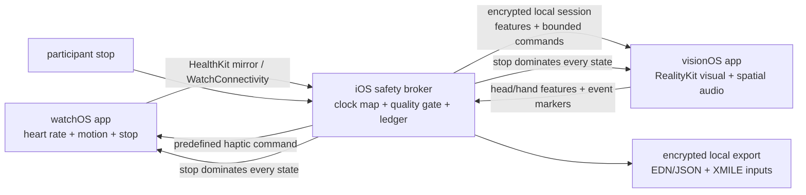

# Apple Vision Pro + Apple Watch private Spirit self-study design

## 1. Purpose and epistemic boundary

This design extends the private `junkawasaki-self-001` N-of-1 protocol with wearable sensing and spatial audiovisual intervention. Here, **Spirit** remains a constructed, time-dependent information model. Head/hand movement, heart rate, and self-report are observations used to estimate that model; they are not direct measurements of a metaphysical entity, diagnosis, or treatment response.

No adaptive intervention may begin until sensing-only and open-loop phases pass their gates. The first implementation is private, local-first, single-participant, and reversible.

## 2. Device roles

| Device | Sensor role | Intervention role | Explicitly excluded |
|---|---|---|---|
| Apple Watch | Live heart rate during an explicit workout session; motion/artifact features; user stop/tap markers; later, discrete HealthKit HRV-SDNN samples for retrospective analysis | Sparse predefined haptic cues | Continuous HRV, medical inference, ECG/SpO2 control, haptic stimulation presented as neuromodulation |
| iPhone | Pairing gateway, clock alignment, safety supervisor, append-only event ledger, encrypted local export | Sends start/stop and bounded policy commands | Cloud relay, autonomous therapeutic decisions |
| Apple Vision Pro | Device/head pose, hand pose with permission, interaction timing, self-report | Low-motion visual field and bounded RealityKit spatial audio | Raw gaze inference, covert camera recording, facial/emotion inference, subliminal or strobing content |

Apple Watch communicates with its companion iPhone. The iPhone then relays bounded events to Apple Vision Pro over an encrypted local session. A Watch-to-Vision-Pro direct dependency is not part of the design.

## 3. Runtime topology

The iPhone broker is the authority for session state. Every renderer and sensor endpoint also implements a local stop so loss of connectivity cannot trap the participant in an intervention.

## 4. Permissions and data minimization

- watchOS asks only for the HealthKit types required for the current phase. Live heart rate is collected only while a visibly active workout session is running. Saving the workout is a separate explicit choice.
- visionOS opens a Full Space only for the active measurement/intervention block. Hand tracking is optional and has its own usage description. World tracking is used for device pose; scene reconstruction and main-camera frames are not requested in v1.
- Gaze is represented only by explicit UI activation or dwell events supplied by the system. The application does not receive or reconstruct raw eye-gaze coordinates.
- Raw hand skeleton and high-rate motion samples remain transient. Persisted records contain windowed features, quality flags, intervention events, and the minimal raw heart-rate samples needed for audit.
- Health data, exports, keys, and participant records never enter Git. The app does not use CloudKit, analytics, crash uploads containing study data, or third-party SDKs. Any OS-level HealthKit synchronization remains under the participant's Apple account and system settings rather than this app's control.

## 5. Event and clock contract

Each device emits an event with:

- `session-id`, `event-id`, `device-role`, and schema version;
- device monotonic time plus wall-clock time for human audit;
- broker-estimated clock offset and uncertainty;
- sequence number, payload, data-quality flags, and consent/protocol version.

The broker estimates clock offset with repeated ping/response samples and uses the lowest-delay samples. It never rewrites source timestamps. Closed-loop adaptation is disabled when clock uncertainty exceeds 250 ms, heart-rate age exceeds 10 seconds, a sequence gap is unresolved, or required authorization/tracking is lost.

## 6. Features and estimator

The estimator consumes 30-second windows updated every 5 seconds:

- Watch: mean and slope of heart rate, valid-sample fraction, motion RMS, and a motion-artifact flag.
- Vision Pro: head angular-velocity RMS, head displacement, hand-motion RMS, gesture/response latency, and tracking quality.
- Participant: the six existing self-report dimensions before and after each block, plus immediate comfort and perceived synchrony.

HRV-SDNN is a discrete retrospective covariate because Apple Watch records it opportunistically; it is not a continuous control signal. The state estimator outputs an `arousal-proxy`, `movement-settling`, `synchrony-confidence`, and overall `sensor-quality`, each in `[0,1]`, with uncertainty. The stored Spirit projection remains the six-dimensional self-report vector plus explicitly labeled physiological/behavioral proxies.

## 7. Intervention policy

### Vision Pro

- Seated experience, stationary real-world reference, minimum necessary immersion.
- Visual modulation remains 0.05–0.15 Hz with no flashes, strobe, subliminal content, rapid peripheral motion, artificial camera motion, or head-locked enclosure.
- Spatial audio uses mono source assets, slow position changes, bounded gain, and a visible volume check before a session.
- Adaptive changes are quantized at block boundaries of at least 15 seconds. No frame-by-frame biometric modulation.

### Apple Watch

- Haptics use only documented predefined `WKHapticType` patterns, one cue at a time, with at least 10 seconds between cues in the research envelope.
- Haptic onset/offset is logged as a measurement-exclusion interval because Watch haptics interrupt HealthKit heart-rate gathering.
- Haptics are off in the initial sensing-only and visual/audio open-loop phases. They are never used as a claimed vagal, neurological, or medical stimulation method.

### Safety supervisor

`effective_intensity = requested_intensity * sensor_quality * safety_enable`, capped by the preregistered envelope. A safety stop sets `safety_enable = 0` immediately and cannot be reversed inside the same session.

Loss of Watch data degrades to the preregistered neutral Vision Pro condition; loss of Vision tracking stops the spatial intervention; loss of the broker stops both. Strong anxiety, derealization, nausea, dizziness, headache, visual disturbance, palpitations, hearing discomfort, or any wish to stop terminates the session.

## 8. Experimental stages and advancement gates

| Stage | Sessions | Active components | Advance only if |
|---|---:|---|---|
| 0 — simulator/dry run | at least 3 | Synthetic events; hardware stop paths | All three local stops work; encrypted ledger round-trips; no internet egress |
| 1 — sensing only | at least 5 | Watch HR/motion + Vision head/hand, no adaptive output | at least 90% usable planned windows; clock uncertainty p95 at most 250 ms; zero safety events |
| 2 — randomized open loop | 8 | Fixed neutral vs fixed bounded audiovisual blocks; Watch haptics off | at least 6 completions and 3/condition; tolerability documented; zero serious safety events |
| 3 — component test | 8 | Add sparse Watch haptic versus no-haptic while Vision stimulus is held fixed | Missing-HR intervals align with haptic log; no evidence analysis depends on those gaps |
| 4 — closed-loop feasibility | 8 | Adaptive policy versus prerecorded/yoked policy | Policy and parameters frozen beforehand; automatic fallback verified; independent protocol review completed |

Do not begin with a 2×2 adaptive audiovisual-by-haptic factorial design: it changes too many causal factors for the initial N-of-1 series. Each stage fixes all but one meaningful intervention component.

## 9. Analysis and System Dynamics

The primary outcome remains the preregistered pre/post self-report score. Wearable values are secondary mechanism and quality measures. Report all sessions, missingness, stop events, condition order, model versions, and uncertainty; do not relabel an exploratory threshold crossing as proof that Spirit was transformed.

`apple-closed-loop-spirit.xmile` models four stocks already used by the project and adds `Interoceptive_Alignment`. Exogenous inputs distinguish sensor quality, physiological proxy, Vision synchrony, Watch haptics, clock error, and safety state. In particular, its haptic-induced sensing gap reduces effective sensor quality rather than pretending simultaneous measurement is available.

## 10. Native implementation slices

1. `SpiritWatch`: SwiftUI watchOS target with HealthKit workout session, live metric delegate, Core Motion quality features, local stop, and sparse haptics.
2. `SpiritBroker`: iOS target with mirrored workout/WatchConnectivity ingestion, local-network peer discovery, clock mapping, policy state machine, Keychain-held encryption identity, and append-only ledger.
3. `SpiritVision`: visionOS SwiftUI + RealityKit target with windowed consent/calibration, optional Full Space, world/hand tracking, spatial renderer, and local stop.
4. Shared Swift package: versioned event types, canonical serialization, feature-window functions, policy limits, deterministic replay, and test vectors.

Hardware studies require physical devices; simulators are only for UI, state-machine, serialization, and fault-injection tests.
